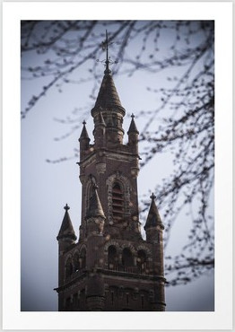

Title: fēmina in turre
Date: 2022-08-12
Category: fābulae
Tags: 
Slug: fēmina in turre
Authors: Caela Calculensis
Summary: dē fēminā in turre inclūsā

Ōlim fuit fēmina, nōmine Carolīna, quae in turre includēbātur, sed haec turris saltem bona erat: Gausapīna balneāria multa molliaque erant, māchina expressa caffeāria erat, et librī optimī! Quōdam diē spatium sēcrētum invēnit sub gausapīnīs, quod librum magnum pulvere tēctum continuit. Cum hunc librum legere coeperet, Carolīna stupuit quia longa fābula, quae inerat, dē hāc turre ipsā erat!

Plūrimās post diēs multumque expressārum, ad fīnem librī Carolīna pervēnit didiceratque turrem aedificātam fuisse a diīs ut quandam deam inclūderent, cujus memoriae ab eīsdem etiam ablātae erant. Illa dea autem in turre librum quendam cēlāverat in locum tam obscūrum ut nūllus deus eum invenīre posset. Quin etiam in pāginā ultimā erat sententia magica, quae memoriās deae redderet dummodo dea ipsa eam recitāret.

«Quidnam!», Carolīna reputāvit. «Haud crēdere possum mē fēminam esse tantam quantam iste liber dīcit! Aliā ex parte,» pergēbat ea, «id explicāre possit cūr memoriae meae tam nūbilōsae sint.» Deinde mīrābātur num sī, illā sententiā lēctā memoriās suās mūtāret, eadem fēmina remanēret. Postrēmō, illa turris locus malus haud erat. Fortasse hōc in statū praesentī laetior esset quam sī dea foret.

Quamquam hae cōgitātiōnēs obstābant, Carolīna sententiam clārē legēbat posteāque scīvit tandem quae quālisque esset ipsa. Utrum eadem fēmina nunc esset annōn quis dīcere posset? Sed liberāta est; potestātibus suīs eī nōtīs, Carolīna discēdit et māchinam expressam sēcum tulit.

