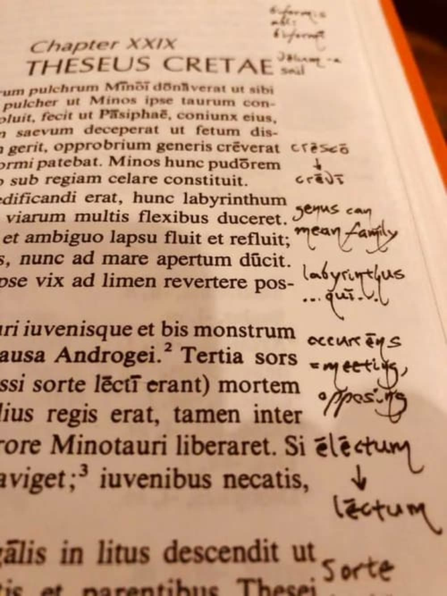

Title: vīta mea per pandēmiam
Date: 2022-07-11
Category: vīta mea
Tags: 
Slug: vīta mea per pandēmiam
Authors: Caela Calculensis
Summary: dē vītā meā per pandēmiam

Ā mēnse martiī hīc eram in īnsulā meā (i.e. domū meā Novae Caesarēae). Solitūdinis causā interdum fuit valdē difficile, sed multī amīcī mihi erant (et sunt!), quibuscum saepe per interrēte loquī poteram. Praecipuē sē cūrābam cottīdiē in varia Latīnē scrīpta legendō, ut Familiam Rōmānam, Ad Alpēs, Rōmam Aeternam.

Sed cur linguam Latīnam ut discerem ēlēgī? Prīmum, quia Lūcium Raniērium apud Tūtūbum audīveram, quārē sciēbam sonitum hujus linguae pulcherrimum esse; secundum, haec lingua per tempus ipsum, per saecula, tendit; tertium summīque: Legēbam cōgitāre in linguā secundā efficere posse ut cōgitātiōnēs nostrae rātiōnāliōrēs essent.

Haec causa discendī postrēma ad quamque linguam pertinēre potest, sed ita reputābam:  quō dīversa illa lingua esset, eō magis velut aliēnī cōgitātiōnēs meae forent! Idem multīs angulīs vidēre potestātem cōgitandī nostram magnopere augēre potest.

