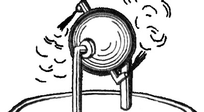

Title: pila Aeolī
Date: 2022-07-11
Category: fābulae
Tags: 
Slug: pila Aeolī
Authors: Caela Calculensis
Summary: dē Aeolī pilō

Crepusculum erat et āēr ex harēnīs calidīs ad caelum adhūc ascendēbat. Plūrēs iam intus erant cum nūper hominēs noctibus abreptī essent. Rēja Valēns, fēmina flammicomantibus comīs viridibusque oculīs, septimānās jam causam invenīre temptāverat, et omnia indicia pȳramidem monstrābant.

Rēja popīnam ambulābat sed nōn ad cēnandum: Juxtā popīnam erat mēnsa lignea cum arcā magnā aēneāque suprā eam. In apice arcae incīsūra erat fundōque forāmen. Rēja lagunculam in forāmine posuit et nummum in incīsūram dēmīsit. Aliquid intrā arcam sonitōs mēchanicōs fēcit et aquam sacram in lagunculam effundēbat. Prīmā lagunculā plēnā, Rēja aliam implēvit. Fēlēs nigra pedem suum lambēns prope mēnsam sedēbat, cui Rēja subrīdēns dīxit “Haec sunt perūtilia!”

Ad pȳramidem iam īvit copide armāta. Forīs apud aditum fax in pariete ardēns erat, quam Rēja cēpit. Deinde in terram dēscendit. Jam in fundō scālae longae ante ingēns conclāve substiterat, nam solum omnīnō tēctum anguibus venēnātīs erat. Rēja ā coxā sacculum sustulit, quī herbam quandam[^1] continēbat. Herbam ante sē spargere incēpit et ecce: Serpentēs herbam fūgērunt quasī ignis esset. Hōc modō Rēja mare anguium dīvīsit et in iter subterrāneum perrēxit.

Rēja cum vēnisset ad bivium subitō ā viā laevā gemitūs sonitōsque titubandī audīvit. Circā angulum mumia appāruit et, cum Rējam vidisset, strīdēre coepit statimque Rējam petīvit. Ea lagunculam aquae sacrae in mumiam jēcit, quae contrā pectus eius confrēgit. Mumia ululāvit et gradum retrō fēcit cum fūmī ā fasciīs ascenderent. Rējae tamen vīsum est tantum īrātiōrem sē mumiam reddidisse, quamobrem in viam dextram circum alium angulum fūgit.

Aut melius dictum fugere finxerat, nam post angulum Rēja copidem suam strīnxit et mumiam expectābat; cum eam sequēns rūrsus appāruit, gladiō suō monstrum percussit. Pectus ejus lacūnam jam habēbat et fasciae scissae ē mumiā pendēbant, sed continuē ad virāginem titubābat. Deinde Rēja fūgit rē vērā, per andrōnem in tenebrīs altīs tendēntem. Post longum cursum ea ad aliud bivium pervēnit et viam sinistram ēlēgit, spērāns nē mumia eandem ēlēgerit.

Nōn multō post haec via Rējam in parvum conclāve obscūrum dūxit. In mediō conclāvī columna saxea stābat et apud eam māchina, quam Rēja nōmine «Pila Aeolī» agnōvit[^2], in quā aēneum clausum aquā replētum et sphaera ex eādem māteriā factā fistulīs coniungēbantur. Sub illā māchinā labrum oleō plēnum erat. Rēja nescīvit cūr māchina hīc esset sed, consiliō in animō, oleum in labrō face tetigit quod statim in flammīs ērūpit. Post paulum sphaera metallica fūriōsē volvere incēpit magnōque strepitū, et paene simul Rēja gemitūs familiārēs ex andrōne audīvit. Rēja post columnam stābat cadāverque animātum expectābat.

Mumia in conclāve intrāvit versusque columnam lentē ambulāvit. Per tōtum tempus Rēja circum columnam movēbat ut ē conspectū eius manēret. Cautē Rēja ā tergō columnae spectābat et in solō fasciam longam vīdit post mumiam tractam. Quam celerrimē fasciam cēpit et in Pilam Aeolī injēcit. Fasciā ā parte māchinae vertentī captā, mumia repente ad automaton revolsa et bis in circulō versa fuit. Jam magna pectoris pars exposita erat.

Foeda carō rūgōsa visibilis erat et odor taeter conclāve implēvit. Opportūnē Rēja in pectus mumiae ultimam lagunculam iniēcit, quae scīlicet sīcut prīma confrēgit. Sed hōc tempore, fasciīs absentibus, fūmī scatūriēbant et mumia ululāns corporeque quatiente in solum cecidit; nōn multō post movēre dēsiit tantumque sonitus Pilae Aeolī audiēbātur.

Cum ēmersisset Rēja tandem ē pȳramide eandem nigram fēlem ē popīnā vīdit. Hāc comite ad illum locum revēnit et cervisiam bibit. Sīc Rēja Valēns aliō diē vīvat ut aliās umbrās aemulētur.[^3]

[^1]: Orīganum Dictamnus appellātur.
[^2]: Hērōn Alexandrīnus hanc māchinam invēnit. "Aeolipyle" vel "Pila Aeolī" vocābātur. Aeolus deus ventōrum est.
[^3]: Aemulārī umbrās = contrā umbrās pugnāre

